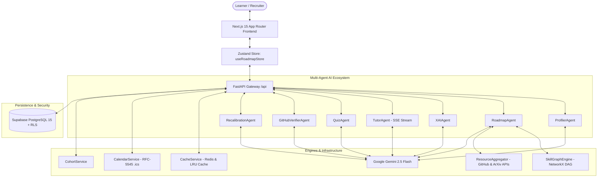

# 🧭 AI Pathfinder

<div align="center">

**Autonomous, Multi-Agent Personalized Learning Path Recommender & Active Mastery Platform**


[](https://nextjs.org/)
[](https://fastapi.tiangolo.com/)
[](https://ai.google.dev/)
[](https://reactflow.dev/)
[](https://supabase.com/)
[](https://www.typescriptlang.org/)
[](https://python.org)
[](https://opensource.org/licenses/MIT)

</div>

---

## 📖 Overview

Over **90% of self-directed technical learners drop out** of traditional online courses due to *tutorial hell*, rigid one-size-fits-all roadmaps, lack of clear explanations, and absence of active skill verification.

**AI Pathfinder** fundamentally solves this problem. It is a fullstack, multi-agent AI curriculum engine that converts open-ended conversational career goals into **dynamic, interactive Directed Acyclic Graphs (DAGs)**. It provides explainable AI justifications, contextual real-time Socratic mentoring, active micro-quiz and live GitHub repository validation, spaced-repetition absence recalibration, 1-click calendar synchronization, and peer accountability cohorts.

---

## 🌟 Key Features

### 1. 🗺️ Dynamic Open-World DAG Synthesis
- **No Hardcoded Paths**: Synthesizes custom technical curriculums for *any* career ambition (e.g. AI Engineering, Rust for Solana, Next.js Fullstack, Bioinformatics).
- **Topological Layout Engine**: Employs NetworkX topological sorting and cycle detection (`ensure_acyclic()`) to guarantee zero circular dependency deadlocks.
- **Topological Phases & Dynamic 2D Coordinates**: Generates horizontal phase lanes (`Foundations`, `Core Concepts`, `Applied Practice`, `Advanced Mastery`) and calculates optimal coordinate grids.

### 2. 🧠 Explainable AI (XAI) Deep-Dive Drawer
- **Why Learn This?**: Delivers personalized 2-3 sentence justifications explaining why each milestone is necessary for the learner's specific goal given their current skill set.
- **Missing Prerequisite Radar**: Explicitly flags any upstream prerequisites still required before tackling a milestone.
- **Distributed Caching**: Caches explanations with MD5-keyed hashes across Redis and memory-bounded LRU caches for sub-10ms repeat inspections.

### 3. 💬 In-Drawer Socratic AI Tutor
- **Contextual Mentoring**: Resides directly inside the milestone inspection drawer with full awareness of the active milestone, phase, and user profile.
- **Real-Time Token Streaming**: Streams responses via Server-Sent Events (SSE) using Google Gemini 2.5 Flash.
- **Socratic Pedagogy**: Guides learners through conceptual roadblocks using Socratic questions rather than dumping raw textbook answers.

### 4. 🛡️ Dual-Track Active Validation
- **Micro-Quiz Engine**: Synthesizes 3 conceptual multiple-choice questions per milestone with instant feedback, explanations, and a >= 66% (2/3) mastery pass requirement.
- **Live GitHub Capstone Verifier**: Inspects public GitHub repository code trees and decodes README files via GitHub REST API, delivering senior engineer code reviews with automated milestone mastery.

### 5. 🔄 Adaptive Curriculum & Career Pivoting
- **Real-Time Re-Balancing**: Ingests qualitative feedback (e.g. *"Actually, I want to switch to Frontend Web Development"*), updates profile targets, and dynamically re-synthesizes downstream milestones while preserving already mastered skills.

### 6. ⏰ Spaced Repetition Recalibration Agent
- **Combating the Forgetting Curve**: When returning after an absence, 1 click generates a 15-minute warmup milestone ahead of the active track with curated cheat sheets, rewiring the DAG to require review before advancing.

### 7. 📅 Smart Calendar Schedule Sync (RFC-5545)
- **1-Click Habit Integration**: Generates downloadable `.ics` calendar files distributing weekly study sessions across weekdays according to weekly availability, compatible with Google Calendar, Apple Calendar, and Outlook.

### 8. 👥 Peer Study Cohorts & Leaderboard
- **Social Accountability**: Automatically clusters learners pursuing identical target roles into peer cohorts (<8 members) and renders a live, dynamically ranked progress leaderboard.

### 9. 🌐 Public Portfolio Showcase & OpenGraph Sharing
- **Proof of Work**: Public vanity URLs (`/{username}`) with server-side dynamic OpenGraph preview cards and interactive read-only roadmap canvases showcasing verified green mastery badges.

---

## 🏗️ Architecture & Dataflow



---

## 📁 Monorepo Project Structure

```
Ai_pathfinder/
├── backend/
│   ├── agents/                     # Multi-Agent AI system
│   │   ├── profiler_agent.py       # Conversational goal intake & profile extraction
│   │   ├── roadmap_agent.py        # Open-world DAG curriculum synthesizer
│   │   ├── xai_agent.py            # Explainable AI personalized justification
│   │   ├── tutor_agent.py          # In-drawer Socratic AI chat tutor
│   │   ├── quiz_agent.py           # 3-question active validation micro-quiz generator
│   │   ├── github_verifier_agent.py# Live GitHub code tree & README analyzer
│   │   └── recalibration_agent.py  # Spaced repetition warmup generator
│   ├── api/
│   │   └── routes.py               # REST API & SSE streaming endpoints
│   ├── database/
│   │   └── client.py               # Supabase database & JWT auth client
│   ├── db/
│   │   └── schema.sql              # PostgreSQL DDL, RLS policies, & auth triggers
│   ├── models/
│   │   └── schemas.py              # Canonical Pydantic schemas & response models
│   ├── services/
│   │   ├── graph_engine.py         # NetworkX cycle detection & 2D layout engine
│   │   ├── resource_aggregator.py  # Live GitHub Search & ArXiv paper aggregator
│   │   ├── cache_service.py        # Redis & memory-bounded LRU caching layer
│   │   ├── calendar_service.py     # RFC-5545 .ics iCalendar generator
│   │   ├── cohort_service.py       # Peer study group allocator & leaderboard
│   │   ├── llm_client.py           # Unified Google GenAI SDK client
│   │   └── rag_service.py          # ChromaDB semantic vector search
│   ├── tests/                      # Pytest automated test suite (38+ tests)
│   ├── main.py                     # FastAPI application entrypoint
│   └── requirements.txt            # Python dependencies
├── frontend/
│   ├── src/
│   │   ├── app/                    # Next.js 15 App Router pages
│   │   │   ├── [username]/         # Public portfolio page with dynamic OpenGraph
│   │   │   ├── login/ & signup/    # Supabase authentication screens
│   │   │   ├── layout.tsx          # Root layout & theme providers
│   │   │   └── page.tsx            # Main application shell & canvas workspace
│   │   ├── components/
│   │   │   ├── chat/               # Conversational goal intake
│   │   │   ├── dashboard/          # Metrics, radar chart, & cohort leaderboard
│   │   │   ├── roadmap/            # React Flow canvas, drawer, tutor, quiz, repo modals
│   │   │   └── ui/                 # Accessible UI design primitives
│   │   ├── lib/
│   │   │   ├── api.ts              # Typed HTTP client & binary blob downloader
│   │   │   ├── supabase/           # Supabase browser & server clients
│   │   │   └── types.ts            # Core TypeScript data contracts
│   │   └── store/
│   │       └── useRoadmapStore.ts  # Zustand central state management store
│   ├── package.json                # Frontend dependencies
│   ├── tailwind.config.ts          # Tailwind CSS v4 styling configuration
│   └── tsconfig.json               # Strict TypeScript configuration
├── .gitignore                      # Root gitignore for clean monorepo management
└── README.md                       # Comprehensive project documentation
```

---

## ⚡ Local Development Quickstart

### Prerequisites
- **Node.js**: v18.0 or higher
- **Python**: v3.11 or higher
- **Google Gemini API Key**: Free from [Google AI Studio](https://aistudio.google.com/)
- **Supabase Account**: Free project from [Supabase](https://supabase.com/)

---

### 1. Backend Setup

```bash
# Navigate to the backend directory
cd backend

# Create and activate a Python virtual environment
python -m venv .venv

# On Windows:
.venv\Scripts\activate
# On macOS / Linux:
source .venv/bin/activate

# Install Python dependencies
pip install -r requirements.txt

# Create your .env file
# (Add GEMINI_API_KEY, SUPABASE_URL, SUPABASE_KEY, SUPABASE_JWT_SECRET)
```

Start the FastAPI development server:
```bash
uvicorn main:app --reload --port 8000
```
> API will run at `http://localhost:8000` (Interactive docs at `http://localhost:8000/docs`).

---

### 2. Frontend Setup

```bash
# Open a new terminal and navigate to the frontend directory
cd frontend

# Install Node.js dependencies
npm install

# Create your .env.local file
# (Add NEXT_PUBLIC_SUPABASE_URL, NEXT_PUBLIC_SUPABASE_ANON_KEY, NEXT_PUBLIC_API_URL=http://localhost:8000/api)
```

Start the Next.js development server:
```bash
npm run dev
```
> Web application will run at `http://localhost:3000`.

---

## 🚀 Production Cloud Deployment Guide

Deploy AI Pathfinder across modern cloud platforms (Vercel, Render/Koyeb/AWS, and Supabase):

```
┌─────────────────┬───────────────────┬──────────────────────────────────────────┐
│ Component       │ Platform          │ Architecture & Hosting Details           │
├─────────────────┼───────────────────┼──────────────────────────────────────────┤
│ Frontend        │ Vercel            │ Next.js 15 SSR, edge routing, global CDN │
│ Backend API     │ Render / Koyeb    │ FastAPI ASGI service with Uvicorn        │
│ Database & Auth │ Supabase          │ PostgreSQL 15+, Row-Level Security (RLS) │
│ LLM Inference   │ Google AI Studio  │ Google Gemini 2.5 Flash GenAI SDK        │
│ Caching Layer   │ Built-in LRU      │ High-speed memory-bounded LRU caching    │
└─────────────────┴───────────────────┴──────────────────────────────────────────┘
```

### 1. Database Setup (Supabase)
1. Create a project at [supabase.com](https://supabase.com).
2. Open the **SQL Editor** and execute `backend/db/schema.sql` to instantiate all tables, indexes, triggers, and Row-Level Security policies.
3. Under **Authentication -> URL Configuration**, set:
   - **Site URL**: `https://your-app.vercel.app`
   - **Redirect URLs**: `https://your-app.vercel.app/**`

### 2. Backend Deployment (Render or Koyeb)
1. Create a **New Web Service** connected to your GitHub repo.
2. Set **Root Directory**: `backend`
3. Set **Build Command**: `pip install -r requirements.txt`
4. Set **Start Command**: `uvicorn main:app --host 0.0.0.0 --port $PORT`
5. Configure Environment Variables:
   - `GEMINI_API_KEY`: *your_google_ai_studio_api_key*
   - `SUPABASE_URL`: `https://your-project.supabase.co`
   - `SUPABASE_KEY`: *your_supabase_anon_or_service_role_key*
   - `SUPABASE_JWT_SECRET`: *your_supabase_jwt_secret*

### 3. Frontend Deployment (Vercel)
1. Import your GitHub repo into [vercel.com](https://vercel.com).
2. Set **Root Directory**: `frontend`
3. Configure Environment Variables:
   - `NEXT_PUBLIC_SUPABASE_URL`: `https://your-project.supabase.co`
   - `NEXT_PUBLIC_SUPABASE_ANON_KEY`: *your_supabase_anon_key*
   - `NEXT_PUBLIC_API_URL`: `https://your-backend.onrender.com/api`
4. Click **Deploy**.

---

## 🧪 Testing & Verification

Run the comprehensive test suites across the monorepo:

### Backend Pytest Suite
```bash
cd backend
python -m pytest tests/ -v
```
> **Result**: 38+ unit and integration tests passing covering all 10 end-to-end workflows, agents, graph engines, and services.

### Frontend TypeScript & Build Verification
```bash
cd frontend
npx tsc --noEmit
npm run build
```
> **Result**: Zero TypeScript errors and clean production Turbopack static page generation.

---


## 📄 License

This project is licensed under the **MIT License**.

